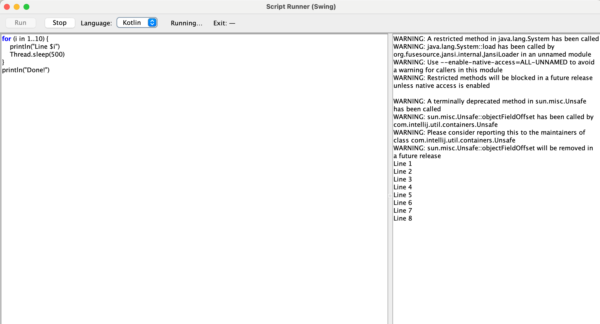
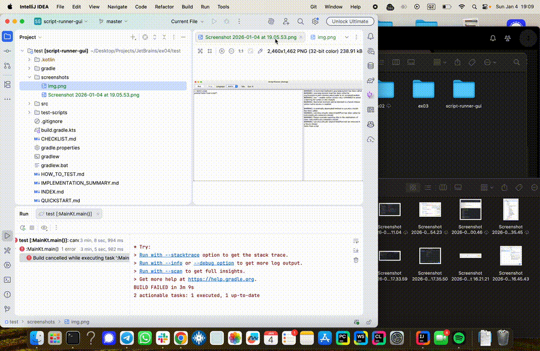

# Script Runner GUI

A modern Swing-based GUI application for running Kotlin and Swift scripts with live output, error navigation, and syntax highlighting.


## Features

### ✅ Core Features (Required)
- **Editor and Output Panes**: Side-by-side layout with resizable split pane
- **Kotlin and Swift Support**: Execute scripts using `kotlinc -script` or `swift`
- **Live Streaming Output**: See output progressively as scripts execute
- **Error Display**: Compiler and runtime errors shown in output
- **Running Indicator**: Visual status showing when script is executing
- **Exit Code Display**: Shows exit code with color coding (red for non-zero)

### ✨ Enhanced Features (Implemented)
- **Keyword Highlighting**: 10 Kotlin keywords highlighted in blue/bold
  - Keywords: `fun`, `val`, `var`, `if`, `else`, `for`, `while`, `return`, `class`, `object`
- **Clickable Error Navigation**: Click error messages to jump to exact line/column in editor
  - Supports both Kotlin (`.kts:LINE:COL:`) and Swift (`.swift:LINE:COL:`) formats
- **Language Selector**: Switch between Kotlin and Swift with dropdown
- **Stop Button**: Terminate long-running scripts
- **Intelligent Kotlinc Discovery**: Finds kotlinc in Gradle cache or PATH with fallback to `/usr/bin/env kotlinc`
- **Concurrent Stream Capture**: Both stdout and stderr displayed in real-time
- **Process Cleanup**: Automatic process termination on window close


### Main Interface





## Requirements

- **Java**: JDK 11 or higher
- **Kotlin**: kotlinc in PATH or Gradle cache (for Kotlin scripts)
- **Swift**: Swift toolchain installed (for Swift scripts)
- **OS**: macOS, Linux, or Windows (macOS recommended for Swift)

## Building and Running

### Quick Start (Recommended)
```bash
# Clone the repository
git clone <repository-url>
cd script-runner-gui

# Run directly (bypasses Gradle, works with any Java version)
./run.sh
```

### Alternative: Gradle
```bash
# Run the application
./gradlew run

# Build JAR
./gradlew build

# Run tests
./gradlew test
```

**Note:** If you encounter Gradle build issues with Java 25+, use `./run.sh` instead.

### Manual Compilation
```bash
# Compile
kotlinc src/main/kotlin/Main.kt -include-runtime -d build/script-runner.jar

# Run
java -jar build/script-runner.jar
```

### Run from IDE
1. Open project in IntelliJ IDEA
2. Right-click `src/main/kotlin/Main.kt`
3. Select "Run MainKt"

## Usage

### Running Kotlin Scripts

1. Select **"Kotlin"** from the Language dropdown (default)
2. Enter your Kotlin script in the left editor pane:
   ```kotlin
   println("Hello from Kotlin!")
   for (i in 1..5) {
       println("Count: $i")
   }
   ```
3. Click **Run**
4. Watch live output in the right pane
5. Check exit code at the top

### Running Swift Scripts

1. Select **"Swift"** from the Language dropdown
2. Enter your Swift script:
   ```swift
   print("Hello from Swift!")
   for i in 1...5 {
       print("Count: \(i)")
   }
   ```
3. Click **Run**
4. Output appears in real-time

### Navigating to Errors

When a script has errors:
1. Look for **blue underlined** lines in the output pane
2. Click the error line
3. Editor cursor jumps to the exact location
4. Fix the error and run again

### Stopping Scripts

For long-running scripts:
1. Click **Stop** button while script is running
2. Process terminates immediately
3. "Process stopped" message appears

## Testing

See [TESTING.md](TESTING.md) for comprehensive testing instructions.

### Quick Test
```bash
# Run a simple test
./gradlew run

# In the application, paste:
println("Testing: ${1 + 1}")

# Click Run - should output "Testing: 2"
```

### Test Scripts
Ready-to-use test scripts are available in `test-scripts/`:
- `1-keyword-highlight.kts` - Test syntax highlighting
- `2-streaming-output.kts` - Test live output
- `3-clickable-error.kts` - Test error navigation
- `4-nonzero-exit.kts` - Test exit code display
- `5-successful-script.kts` - Test success case
- `6-swift-basic.swift` - Test Swift execution
- `7-swift-error.swift` - Test Swift errors
- `8-long-running.kts` - Test stop button
- `9-stdout-stderr.kts` - Test stream capture

See [test-scripts/README.md](test-scripts/README.md) for details.

## Architecture

### Project Structure
```
script-runner-gui/
├── src/main/kotlin/
│   └── Main.kt              # Main application (single file)
├── test-scripts/            # Test scripts for validation
├── build.gradle.kts         # Gradle build configuration
├── TESTING.md              # Comprehensive testing guide
└── README.md               # This file
```

### Key Components

**Main.kt** (~300 lines, single file implementation)
- `JTextPane` editor with document listener for highlighting
- `JTextPane` output with styled text for errors
- Process management with concurrent stream reading
- Clickable error detection and navigation
- Language-specific runner discovery

### Design Decisions

**Why Single File?**
- Simple, focused implementation
- Easy to review and understand
- All logic visible at once
- No over-engineering

**Why JTextPane?**
- Styled text support for syntax highlighting
- Character-level attribute control
- Compatible with error offset tracking
- Native Swing component (no external deps)

**Why Regex for Highlighting?**
- Simple and effective for 10 keywords
- Lightweight (runs on every keystroke)
- No external parser library needed
- Easy to extend

**Why Separate Kotlin/Swift Runners?**
- Different execution models (kotlinc -script vs swift)
- Different error message formats
- Language-specific discovery (kotlinc in Gradle cache)

## Known Limitations

- **Highlighting**: Simple regex doesn't distinguish keywords in strings/comments
- **Single Run**: Only one script can run at a time (by design)
- **Large Scripts**: Syntax highlighting may lag on files >10,000 lines
- **Error Formats**: Relies on standard error formats (may vary by compiler version)
- **No Autocomplete**: Basic editor without IDE features

## Future Enhancements

Potential improvements (not implemented):
- Full syntax highlighting with lexer
- Autocomplete and code intelligence
- Multiple tabs for different scripts
- Persistent script storage
- Script history
- Output search/filter
- Breakpoint debugging
- More languages (Python, JavaScript, etc.)
- Themes and customization
- Output export

## Technical Details

### Dependencies
- **Kotlin Stdlib**: 2.1.0
- **Java Swing**: Built-in (no external UI libraries)
- **Gradle**: 8.12 (wrapper included)

### Compatibility
- **JVM**: 11+
- **Kotlin**: 2.1.0
- **Swift**: 5.x+ (for Swift scripts)
- **OS**: Tested on macOS, should work on Linux/Windows

### Performance
- Editor highlighting: <10ms for typical scripts
- Output streaming: Real-time, no buffering delay
- Process startup: ~100-500ms (kotlin), ~50ms (swift)
- Memory: ~50-100MB typical usage

## Troubleshooting

### "kotlinc executable not found"
- Ensure kotlinc is installed: `which kotlinc`
- Or install via Gradle: `./gradlew build` (uses embedded kotlinc)
- Or install SDKMAN: `sdk install kotlin`

### "Permission denied" when running kotlinc
- The app automatically falls back to `/usr/bin/env kotlinc`
- If still failing, make kotlinc executable: `chmod +x <kotlinc-path>`

### Swift not working
- Install Xcode Command Line Tools: `xcode-select --install`
- Or download Swift from [swift.org](https://swift.org)
- Verify: `swift --version`

### Keywords not highlighting
- Ensure "Kotlin" is selected in Language dropdown
- Try typing manually to trigger highlighting
- Check that keywords are not in strings (not parsed)

### Errors not clickable
- Verify error format matches `file.kts:LINE:COL:` or `file.swift:LINE:COL:`
- Some compiler versions may format differently
- Check that error line is blue and underlined

### Application freezes
- Likely a very long-running script
- Use Stop button to terminate
- Check script logic for infinite loops

## Contributing

Contributions welcome! Please:
1. Fork the repository
2. Create a feature branch
3. Make your changes
4. Test thoroughly (see TESTING.md)
5. Submit a pull request

## Author

Created as a technical interview assignment demonstrating:
- GUI development (Swing)
- Process management
- Stream handling
- Syntax highlighting
- Error handling
- Cross-platform compatibility

## Acknowledgments

- Kotlin team for kotlinc scripting support
- Swift team for swift interpreter
- JetBrains for inspiration

---

**Note**: This implementation prioritizes clarity, functionality, and testability over advanced features. It demonstrates core competencies in Java/Kotlin GUI development, process management, and user experience design.

